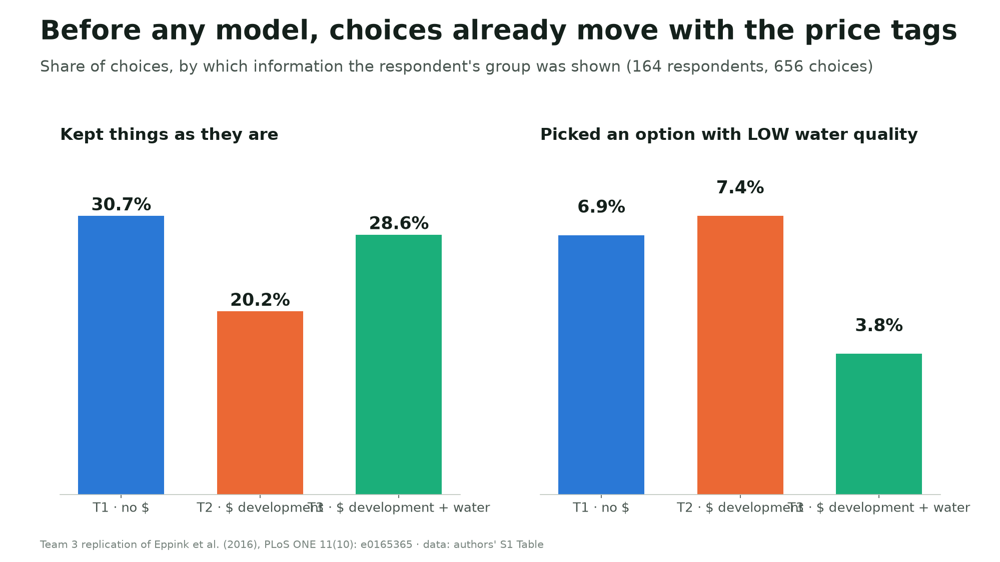
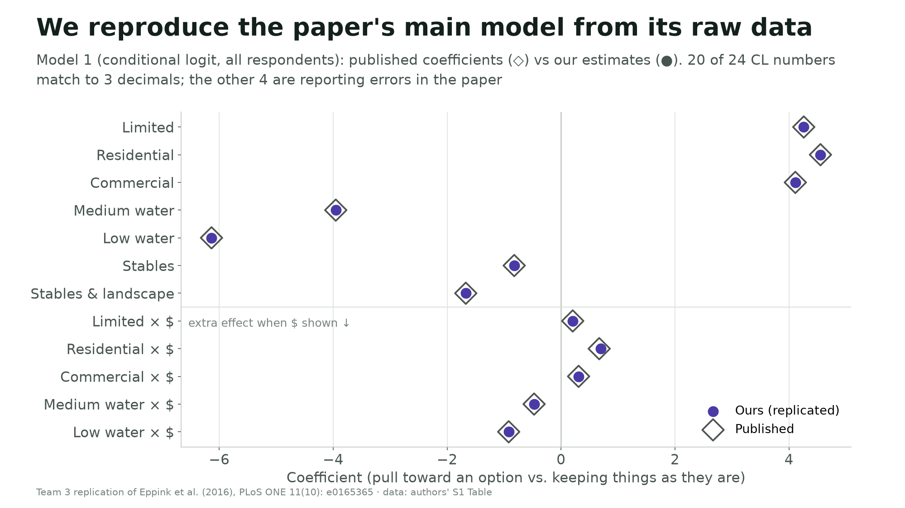
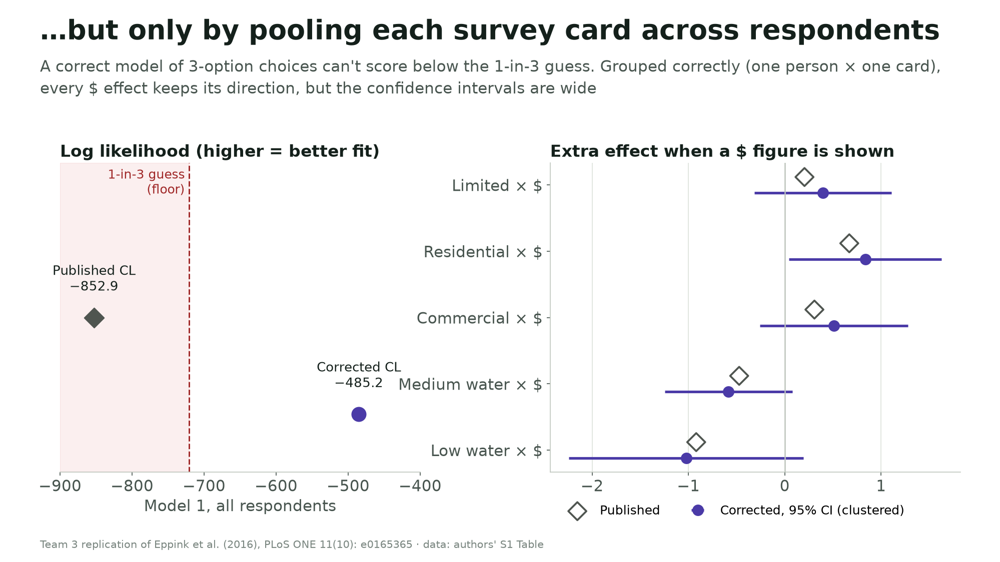
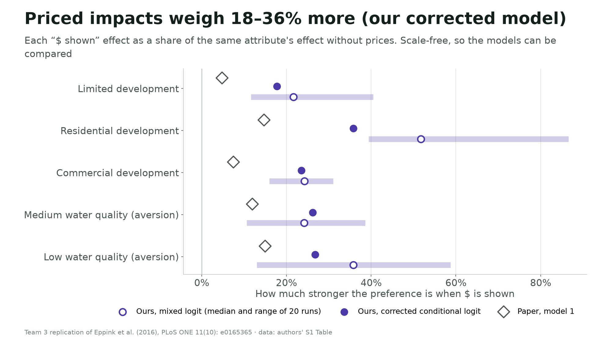

# Presentation guide (Week 10)

A starting plan for the 6–8 minute presentation. It follows the course's arc (paper → what we did → appraisal → recommendations) with the **appraisal on two slides**. The figures below are generated by `Data-Parsing/06_slide_figures.py`; every number in them comes from the code. Section owners and the final wording are for the team to decide.

## Suggested slide sequence

| # | Slide | Visual | Say (one idea per slide) | Time |
|---|---|---|---|---|
| 1 | **The question** | Screenshot of the dashboard's "survey card" section | "If only some impacts of a decision have a price tag, do decision-makers tilt toward them? 164 NZ councillors, three randomly assigned information groups." | ~1 min |
| 2 | **The raw pattern** | `slide1_raw_pattern.png` | "Before any model: with revenue figures, people kept the status quo less often. With water losses priced, low-water options were picked about half as often." | ~1 min |
| 3 | **We reproduced it** | `slide2_reproduced.png` | "From the authors' raw file we reproduce 20 of 24 main-model numbers to three decimals. We traced the other 4 to reporting errors, e.g. standard errors printed as coefficients." | ~1 min |
| 4 | **Appraisal 1: how the model is set up** | `slide3_grouping_issue.png` | "The match only works if each survey card is treated as one pooled choice. Set up the standard way, the effects keep their direction but are less certain." | ~1.5 min |
| 5 | **Appraisal 2: how robust it is** | `../Data-Parsing/output/figures/ml_sensitivity.png` (or three short bullets) | "The headline mixed-logit numbers move with the random draws; the councillor-only result isn't stable. There are also small samples (about 55 per group) and design limits." | ~1.5 min |
| 6 | **What a council should take from this** | `slide4_effect_size.png` | "In our corrected model, a price tag makes an impact weigh about 18–36% more. Present unpriced impacts (culture, habitat) with equal weight, or price them where credible. Treat exact sizes with caution." | ~1.5 min |

Optional: a 30-second live demo of the dashboard's **"Try the model"** section. Change the information group and watch the predicted choices shift.

## Likely questions, and honest answers
- **"So is the paper wrong?"** Its direction holds in every version we ran. What's uncertain is how big and how precise the effect is, because of a modelling choice the paper doesn't disclose and some reporting errors.
- **"How do you know your version is right if you didn't use Stata?"** Two independent tools (Python and R) give identical conditional-logit results, and our fit statistics match the paper's. For the mixed logit we show the full range across simulation runs rather than claiming one exact number.
- **"What about the numbers that didn't match?"** Each one traces to the paper, not our code: two are standard errors printed as coefficients, one is a typo its own p-value contradicts, one p-value likely comes from an earlier 180-person run, and the town-size row fits 188 respondents, more than the published file contains (`output/tables/discrepancy_diagnosis.csv`).
- **"Why pool by card at all?"** We can't know the authors' reasoning. Most likely it was a grouping variable chosen by mistake, because the same variable works correctly in their mixed logit, which nests it within each respondent.
- **"Would this apply here (California / San Luis Obispo)?"** It's one country, one survey (2015), and 164 people. It is a hypothesis worth testing locally rather than a settled fact.
- **"Why wasn't culture priced?"** By design. The authors say framing culture differently (for example as Māori heritage or a regulated site) might have produced stronger effects.

## Delivery reminders (from the course norms)
Don't read slides; use few words and let the figures carry each point; rehearse the handoffs; keep to 6–8 minutes; it's fine to say "we're not sure, but here's our best thinking."
